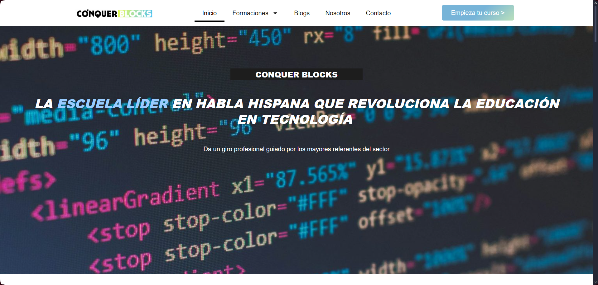
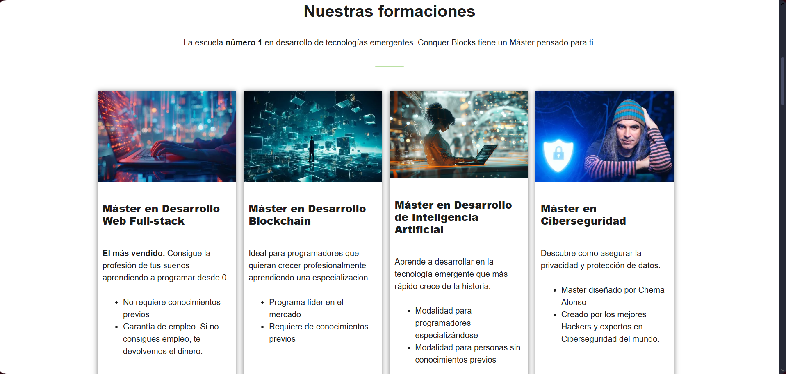
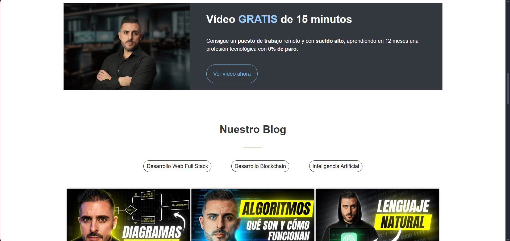
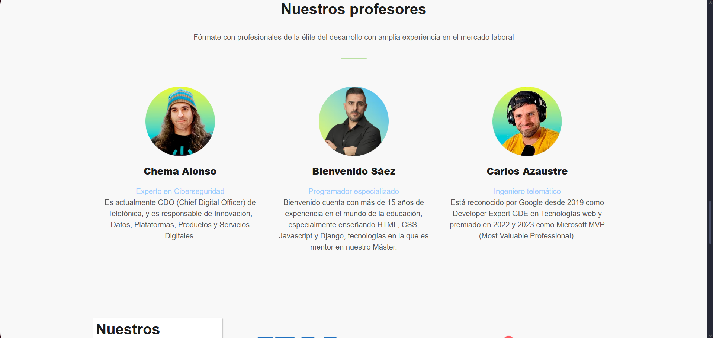
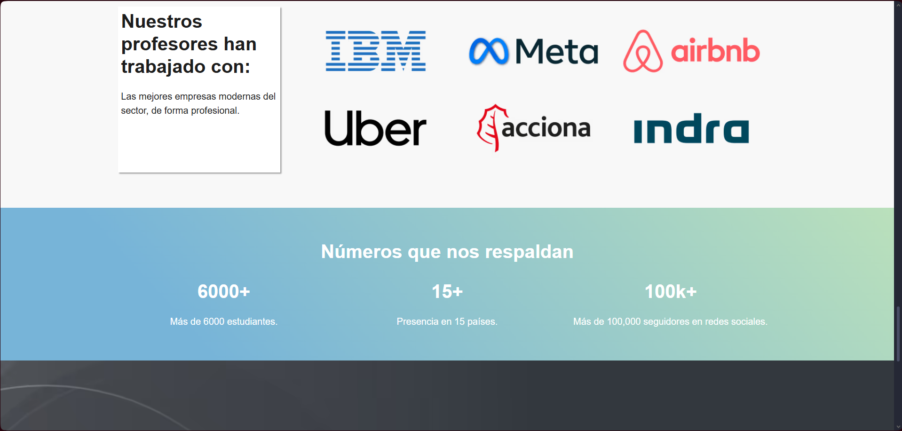
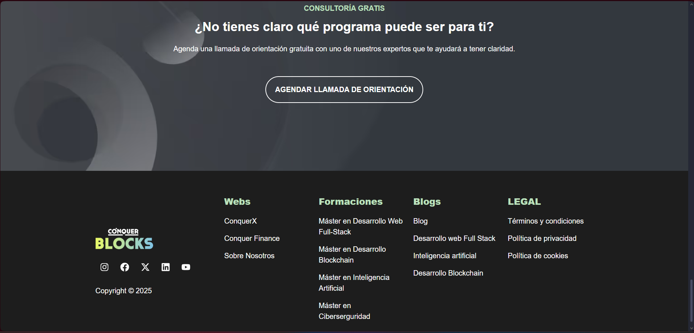

# 🎷 Proyecto WordPress - ConquerBlocks

Este repositorio contiene una adaptación del sitio **Conquerblocks** desarrollada con **WordPress** como CMS, utilizando **Laragon** como entorno de desarrollo local. El sitio simula la academia ConquerBlocks con sus Masters, blogs, etc.

Este proyecto fue creado como práctica personal para aprender a trabajar con WordPress a nivel profesional y desarrollar funcionalidades de una pagina web.

---

## ⚙️ Características del Proyecto

- Sitio basado en el diseño original de [ConquerBlocks](https://www.conquerblocks.com) (referencia online).
- Maquetado para escritorio (desktop) con diseño **responsive** adaptado a **tablets** y **celulares**.
- Desarrollo realizado con **WordPress** 
- Base de datos exportada y lista para importar en otro entorno local.
- Funcionalidades: navegación por masters, blogs, informacion sobre profesores, y más.

---

## 🪰 Requisitos

- [Laragon](https://laragon.org/) (recomendado) o cualquier entorno con:
  - PHP
  - MySQL o MariaDB
- Navegador moderno (Chrome, Firefox, etc.)
- phpMyAdmin (incluido en Laragon)
- Composer (opcional)

---

## 🚀 Cómo usar este repositorio

1. **Clonar el repositorio**

   Cloná este repositorio dentro de la carpeta `www` de Laragon:

   ```bash
   git clone https://github.com/tuusuario/Proyecto_wordpress_conquerblocks.git
   ```

2. **Importar la base de datos**

   - Abrí `http://localhost/phpmyadmin` o `http://localhost/adminer`.
   - Creá una nueva base de datos (por ejemplo: `conquerblocks`).
   - Importá el archivo SQL ubicado en `database/backup.sql`.

3. **Configurar **``

   - Editá el archivo `wp-config.php` en la raíz del proyecto.
   - Cambiá el nombre de la base de datos y las credenciales si es necesario:
     ```php
     define( 'DB_NAME', 'conquerblocks' );
     define( 'DB_USER', 'root' );
     define( 'DB_PASSWORD', '' );
     define( 'DB_HOST', 'localhost' );
     ```

4. **Levantar el servidor local**

   - Iniciá Laragon.
   - Accedé al sitio desde tu navegador.

---

## 📝 Notas importantes

- La carpeta `wp-content/uploads` **no está incluida** por cuestiones de peso. Puedes agregar tus propias imágenes si es necesario.
- El sitio está adaptado para **escritorio, tablets y celulares**.

---

## 🖼️ Capturas de pantalla

### 🏠 Home








